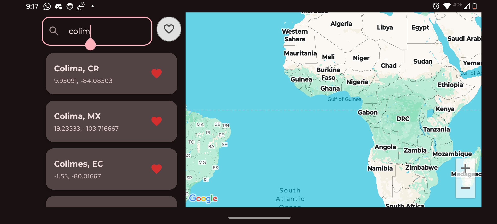

# Search Implementation - README

## Overview

This document outlines the approach taken to solve the search problem efficiently within the application. Several strategies were evaluated to determine the best balance between performance, scalability, and user experience.

## Approaches Considered

### 1. Direct Query Without Pagination

The initial approach involved querying all records directly from the SQLite database and displaying them without any pagination.

- **Pros**: Very simple to implement.
- **Cons**: This method led to poor performance as the dataset grew. Loading and rendering large amounts of data caused significant delays and negatively impacted the user experience.

### 2. Manual Pagination with Raw SQL Queries

The second approach consisted of writing raw SQL queries to manually handle pagination logic on the application side.

- **Pros**: Better performance compared to loading the full dataset. Offers flexibility and control over query structure.
- **Cons**: While suitable for small applications or datasets, this approach is harder to maintain and less scalable. The manual handling of pagination introduces complexity and room for errors as the application evolves.

### 3. Using the Paging Library (Final Choice)

The final and adopted solution was to integrate the [Android Paging Library](https://developer.android.com/topic/libraries/architecture/paging) to manage data pagination directly from SQLite.

- **Pros**:
  - Efficient and incremental data loading.
  - Low memory usage — only the required data is loaded per page.
  - Seamless user experience with smooth scrolling and minimal loading times.
  - Reactive and lifecycle-aware integration with ViewModel and LiveData/Flow.
- **Cons**: Slightly more setup required compared to manual methods, but the long-term benefits outweigh this.

## Additional Decisions

- **Database Usage**: All search operations were performed directly on SQLite. I intentionally avoided loading the full dataset into memory, which would have increased memory consumption and CPU usage.
- **Performance**: The Paging Library provided a significant performance improvement, especially with larger datasets. It allowed the UI to remain responsive and fast, even during intensive searches.
- **Scalability**: This setup is scalable and can support future enhancements, such as combining local and remote sources, or advanced filtering.

## Detail View Enhancements with External APIs

In the detail view of each selected item (e.g., country or language), I integrated two external APIs to enhance the user experience:

1. **Gemini AI API**: Used to dynamically generate additional information related to the selected country or language. This allows for richer, AI-generated context that adapts to each item.

2. **Pexels API**: Used to fetch a relevant image based on the selected item. While some images may be repeated depending on the availability and relevance of results from Pexels, it enhances visual appeal.

> **Note**: I intentionally avoided using the Gemini API to fetch images. During testing, images returned by Gemini frequently led to `404 Not Found` errors, even after modifying prompts extensively. Therefore, all image content is sourced exclusively from Pexels to ensure reliability.

## Conclusion

After exploring multiple strategies, I chose the Paging Library with SQLite as it offers the best trade-offs in terms of efficiency, maintainability, and user experience. Combined with external APIs for content enrichment, this approach ensures the app remains fast, responsive, and visually engaging while keeping resource usage optimal.

## Screenshots

### Portrait:

### Landscape:

